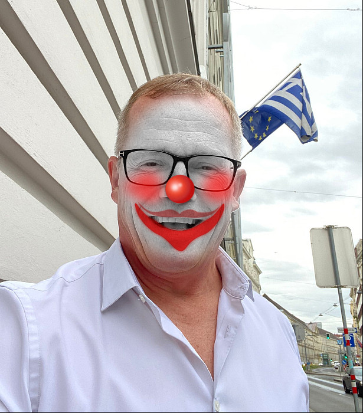
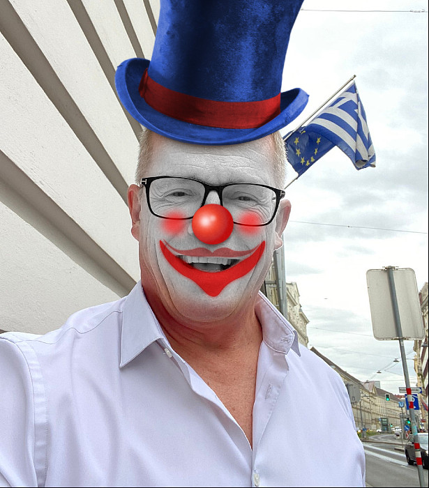

# PhotoFunia Go Client

[](https://pkg.go.dev/github.com/swiftyspiffy/photofunia)
[](https://goreportcard.com/report/github.com/swiftyspiffy/photofunia)
[](https://opensource.org/licenses/MIT)

A Go client library for programmatically applying PhotoFunia image effects to your photos.

## Features

- Apply various PhotoFunia effects to images
- Simple, idiomatic Go API
- Customizable logging
- Thoroughly tested

## Installation

```bash
go get github.com/swiftyspiffy/photofunia
```

## Usage

### Basic Example

```go
package main

import (
	"fmt"
	"os"
	"io/ioutil"

	"github.com/swiftyspiffy/photofunia"
)

func main() {
	// Create a new client
	client := photofunia.NewPhotoFuniaClient()

	// Open an image file
	file, err := os.Open("your-image.jpg")
	if err != nil {
		fmt.Printf("Error opening file: %v\n", err)
		return
	}

	// Apply the "fatify" effect
	resultBytes, err := client.Fatify(file)
	if err != nil {
		fmt.Printf("Error applying effect: %v\n", err)
		return
	}

	// Save the result
	if err := ioutil.WriteFile("result.jpg", resultBytes, 0644); err != nil {
		fmt.Printf("Error saving result: %v\n", err)
		return
	}

	fmt.Println("Successfully applied effect and saved to result.jpg")
}
```

### With Custom Logger

```go
package main

import (
	"fmt"
	"log"
	"os"

	"github.com/swiftyspiffy/photofunia"
)

// CustomLogger implements the photofunia.Logger interface
type CustomLogger struct {
	logger *log.Logger
}

func (l *CustomLogger) Debug(msg string, fields ...photofunia.Field) {
	l.logger.Printf("DEBUG: %s %v", msg, fields)
}

func (l *CustomLogger) Info(msg string, fields ...photofunia.Field) {
	l.logger.Printf("INFO: %s %v", msg, fields)
}

func main() {
	// Create a custom logger
	logger := &CustomLogger{
		logger: log.New(os.Stdout, "", log.LstdFlags),
	}

	// Create a client with the custom logger
	client := photofunia.NewPhotoFuniaClientWithLogger(logger)

	// Use the client as in the basic example
	// ...
}
```

## Available Effects

Currently, the following effects are supported:

- **Fatify**: Makes faces appear fatter
- **Clownify**: Adds clown makeup to faces (with optional hat)

## Examples

### Fatify Effect

Original Image | Result
:------------:|:-------------:
 | 

### Clownify Effect (without hat)

Original Image | Result
:------------:|:-------------:
 | 

### Clownify Effect (with hat)

Original Image | Result
:------------:|:-------------:
 | 

## Contributing

Contributions are welcome! Please feel free to submit a Pull Request.

## License

This project is licensed under the MIT License - see the [LICENSE](LICENSE) file for details.
